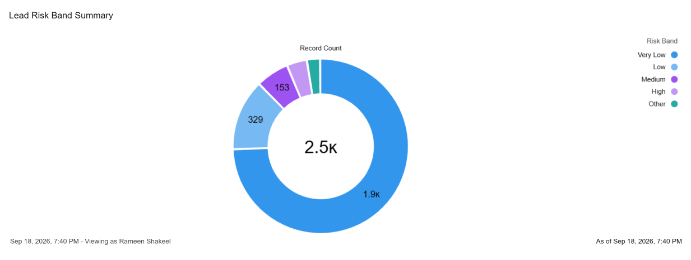
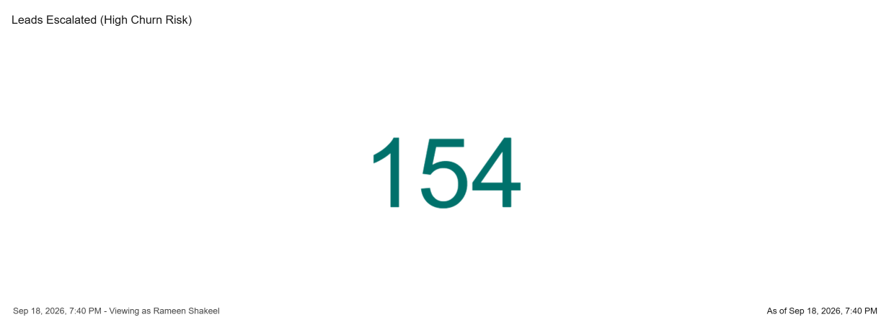

# CRM Automation & Predictive Risk Scoring on Salesforce

A Salesforce Service Cloud + Python project demonstrating end-to-end CRM automation across two
business problems: support ticket triage and customer churn risk, both scored programmatically
and surfaced directly inside Salesforce for a team to act on.

## The business problem

Two common CRM pain points, solved the same way:

1. **Support tickets get triaged manually.** Someone has to notice a ticket has been open too
   long, or that a high-priority issue is quietly aging past SLA.
2. **Churn risk sits in a spreadsheet or notebook, disconnected from the CRM.** A data team can
   build a great churn model, but if the score never reaches the CRM records reps actually work
   from, it doesn't change behavior.

This project builds two small end-to-end systems inside one Salesforce org that both follow the
same pattern: pull in structured data, score it, route/flag it automatically, and make the result
visible without anyone having to go looking for it.

## System 1: Case Triage & Escalation

**Salesforce (Service Cloud):**
- Custom Case fields: `Days_Open__c`, `Risk_Score__c`, `Category__c` (Billing / Technical / General)
- Two Omni-Channel queues (`Tier 1 Support`, `Billing Issues`)
- A Case Assignment Rule that auto-routes new cases to the correct queue based on Category
- A Record-Triggered Flow (`Case Auto-Escalation`) that bumps a case's Priority to High once
  it's been open more than 3 days
- A custom `Article` object with a sample support runbook

**Python:**
- `generate_synthetic_cases.py` generates 150 realistic synthetic support tickets (no real
  customer data was available, so synthetic data was used to test the full pipeline end to end)
- `load_cases_to_salesforce.py` inserts the tickets as real Case records, using the
  `Sforce-Auto-Assign` header so each insert actually triggers the assignment rule (a detail that
  matters — Salesforce's Bulk API silently skips assignment rules unless you explicitly ask it not to)
- `score_cases.py` pulls case data back out via SOQL and writes a risk score to each record

**Risk score formula** (a transparent weighted rule, not a trained model — there's no historical
outcome data in a demo org to train one on): 
```
risk_score = (priority_weight × 0.6) + (days_open_normalized × 0.4)
```

where `priority_weight` is Low = 0.2, Medium = 0.5, High = 0.9, and `days_open_normalized` is
days open ÷ 10, capped at 1.0. Priority is weighted more heavily since a High-priority case
that's also been sitting for a while is the riskiest combination.


## System 2: Lead Churn Risk & Escalation

The second half of this project takes a real predictive model's output and operationalizes it
inside the same Salesforce org — same pattern as the Case system, applied to customer churn
instead of support tickets.

The churn scores come from a Logistic Regression model (ROC AUC 0.90) built in a separate
project, [CRM_Project](https://github.com/rameenshakeell/CRM_Project), which trains and validates
churn and lead-conversion models on synthetic SaaS customer data and explains predictions with
SHAP. This project doesn't retrain or touch that model — it takes its already-scored output
(2,500 customers) and builds the CRM-facing half: getting that score in front of a team, in a
system they'd actually work from day to day.

**Salesforce:**
- Custom Lead fields: `Churn_Risk_Score__c` (the model's predicted probability), `Risk_Band__c`
  (a 5-value picklist: Very Low, Low, Medium, High, Very High)
- A segmented list view (`High Risk Leads`) filtering to High/Very High risk leads for quick triage
- A Record-Triggered Flow (`Lead Churn Escalation`) that, on Lead creation, checks whether
  `Risk_Band__c` is High or Very High and if so: updates Lead Status to `Escalated - High Risk`
  and auto-creates a follow-up Task due in 2 days, owned by the rep
- A Report (`Lead Risk Band Summary`) and Dashboard (`Churn Risk Overview`) visualizing the
  full risk distribution and the count of escalated leads

**Python:**
- `load_leads_to_salesforce.py` reads the churn-scored CSV and inserts each row as a Lead,
  mapping the model's probability and risk band into the two custom fields

## Dashboard





Of 2,500 leads loaded, 154 (6.2%) fell into the High or Very High risk bands and were
automatically escalated — each with a Task already sitting in a rep's queue before anyone had to
go looking for it.

## What I'd track if this were live

- **% of High/Very High risk leads with an outcome (renewed, churned, or worked) within 30 days
  of escalation.** The core effectiveness metric for the churn system.
- **% of high-risk cases (Risk Score > 0.7) resolved before SLA breach**, and **average
  time-to-escalation** for cases that eventually hit High priority — should trend down since
  escalation is automatic now, not dependent on an agent noticing.
- **Queue balance** — whether Category-based case routing is distributing load evenly, or
  whether one queue is consistently overloaded.
- **Adoption** — whether reps are actually working from the Risk Band list view and escalated
  Tasks, versus working leads/cases in raw creation order regardless of the score.

## Honest limitations

- Case data is synthetic; there's no ground truth to validate the risk score against, so it's a
  transparent rule, not a trained model.
- Lead data is synthetic SaaS customer data (see CRM_Project for details on how it was generated
  and validated) — this project consumes the score, it doesn't generate or validate it.
- Salesforce Reports and Dashboards are metadata that lives in the org, not in this repo as
  files — the CLI's metadata retrieval for folder-based types (Reports/Dashboards) has known
  reliability issues, so they're documented here as screenshots rather than retrieved XML.
- Authentication uses a CLI-issued session token for local development. A production
  integration would use a proper OAuth Connected App or scheduled Named Credential instead.
- The `Article` object is a custom stand-in for full Salesforce Knowledge, since Knowledge
  Article Type layout configuration was out of scope for a single demo article.

## Setup

```
pip install -r requirements.txt
cp .env.example .env   # fill in your real SF_SESSION_ID and SF_INSTANCE_URL

# Case triage system
python generate_synthetic_cases.py
python load_cases_to_salesforce.py
python score_cases.py

# Lead churn risk system
python load_leads_to_salesforce.py
```